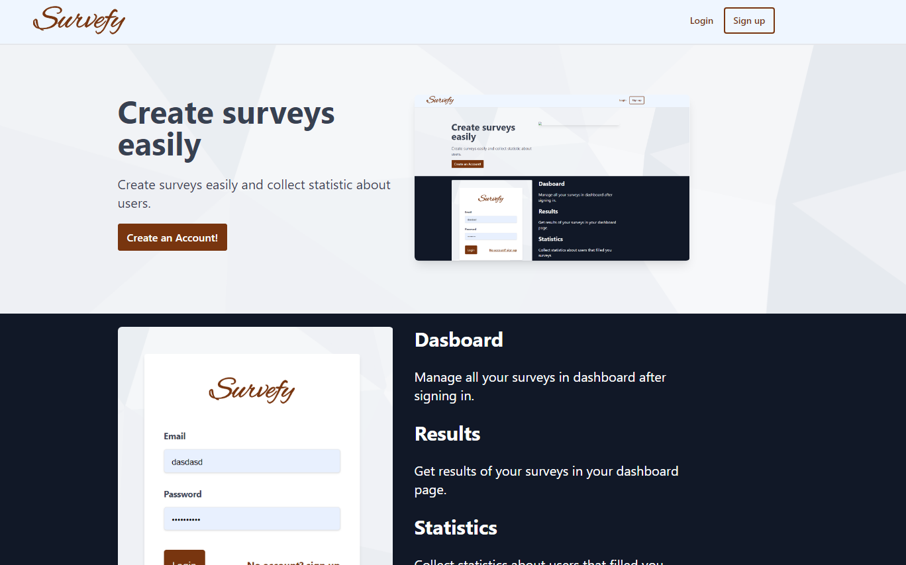

# Survefy (Work in progress)

Webapp fo creating and sharing surveys.

Right now only landing page and authorization is implemented.



## Development

This is a [Next.js](https://nextjs.org/) project bootstrapped with [`create-next-app`](https://github.com/vercel/next.js/tree/canary/packages/create-next-app).

First start mongodb container, using docker-compose

```bash
docker-compose up -d
```

Then, run the development server:

```bash
yarn dev
```

Open [http://localhost:3000](http://localhost:3000) with your browser to see the result.